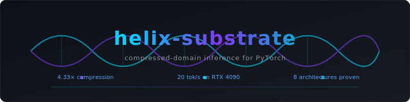

<p align="center">
  
</p>

<p align="center">
  <a href="https://github.com/echo313unfolding/helix-substrate/blob/master/LICENSE"></a>
  <a href="https://www.python.org/downloads/"></a>
  <a href="https://pytorch.org/"></a>
</p>

---

Run larger open models on smaller hardware with bounded quality loss.

**HelixLinear** is a drop-in `nn.Linear` replacement for PyTorch. Weights are stored as VQ codebook indices (CDNA v3) and executed directly from compressed form — never fully materialized in memory. On CUDA, a fused Triton kernel does gather-matmul without creating the full weight matrix.

## Cloud benchmark: Qwen2.5-7B-Instruct on RTX 4090

| Metric | Value |
|--------|-------|
| Compression | 26,971 MB → 6,228 MB (**4.33x**) |
| Perplexity (WikiText-2, 8192 tokens) | 7.7129 |
| Decode speed | 20.1 tok/s (128 tokens), 20.3 tok/s (256 tokens) |
| Prefill speed | 7.7 tok/s (302 tokens) |
| VRAM loaded | 10,390 MB |
| VRAM peak | 13,257 MB (55% of 24 GB — 11 GB headroom) |
| Load time | 4.1 seconds (shell + factors + swap + GPU move) |
| Total benchmark wall time | 162 seconds |
| Compute cost | ~$0.03 on TensorDock |

196 HelixLinear modules, 1 nn.Linear remaining (lm_head). Full pipeline exercised: kurtosis-routed offline compression → Triton fused VQ gather-matmul → phase-aware sidecar → SVD residual correction.

Receipt: [`receipts/cloud_bench/cloud_bench_qwen2.5-7b-instruct_20260324T155918.json`](receipts/cloud_bench/cloud_bench_qwen2.5-7b-instruct_20260324T155918.json)

## Multi-architecture compression scorecard

| Model | Architecture | Tensors | Ratio | PPL Delta | VRAM | Receipt |
|-------|-------------|---------|-------|-----------|------|---------|
| TinyLlama 1.1B | Transformer | 154 | 4.26x | +0.78% | 926 MB | `receipts/step7_helix_linear/` |
| Qwen2.5-Coder-1.5B | Transformer (GQA) | 196 | 4.70x | +1.73% | 1,313 MB | `receipts/qwen_phase3/` |
| Qwen2.5-3B-Instruct | Transformer (GQA) | 252 | 4.43x | +0.69% | 1,213 MB | `receipts/qwen3b_instruct/` |
| Qwen2.5-7B-Instruct | Transformer (GQA) | 196 | 4.33x | — | 10,390 MB | `receipts/cloud_bench/` |
| Mamba-130m | SSM | 97 | 3.92x | — | CPU | `receipts/mamba_compress/` |
| all-MiniLM-L6-v2 | Encoder | 37 | 3.94x | cos=0.9989 | — | `receipts/non_llm_proof/` |
| CLIP ViT-B/32 | Vision-Language | 146 | 3.98x | cos=0.997/0.999 | — | `receipts/non_llm_proof/` |
| ResNet-18 | CNN | 1 | 3.97x | cos=0.9999 | — | `receipts/non_llm_proof/` |

Mamba-130m is the first SSM (non-transformer) through the pipeline. `swap_to_helix()` gates on `isinstance(module, nn.Linear)`, automatically skipping Embedding, Conv1d, and other non-linear modules on any architecture.

## How it works

```
W ≈ codebook[indices] + sidecar_corrections + (U * s) @ Vt
```

- **codebook**: 256 float32 cluster centers (1 KB per tensor)
- **indices**: uint8 assignments per weight (4x smaller than float32)
- **sidecar**: sparse outlier corrections for high-sensitivity positions
- **SVD residual**: optional low-rank correction for high-kurtosis layers

### Kurtosis routing (offline, at compression time)

The codec router uses Fisher kurtosis of weight distributions to decide compression strategy. High-kurtosis tensors (heavy tails, outlier-rich) get VQ + SVD rank-8 residual correction. Low-kurtosis tensors get VQ-only. This is an **offline decision** made during compression — it adds zero runtime latency.

Cross-architecture validation:

| Model | Architecture | n | Spearman rho | p-value |
|-------|-------------|---|-------------|---------|
| TinyLlama 1.1B | Transformer | 154 | 0.7835 | 3.2e-33 |
| Mamba-130m | SSM | 97 | 0.8534 | 1.2e-28 |
| Qwen2.5-7B-Instruct | Transformer (GQA) | 196 | 0.5334 | 8.3e-16 |

The correlation between kurtosis and VQ error is a property of gradient descent, not attention architecture. It transfers across model families.

Preflight scanner: `python tools/kurtosis_scan.py --model ~/models/your-model` (2-second diagnostic, no compression needed).

## Quick start

```python
from helix_substrate.helix_linear import HelixLinear, load_cdna_factors, swap_to_helix

# 1. Load pre-compressed factors
factors = load_cdna_factors("/path/to/cdnav3/", model)

# 2. Replace nn.Linear → HelixLinear (one-shot surgery)
model = swap_to_helix(model, factors)
model = model.cuda().eval()

# 3. Use normally — forward() runs from compressed form
output = model(input_ids)
```

### Compress a model

```python
from helix_substrate.cdnav3_writer import CDNAv3Writer
from helix_substrate.tensor_policy import get_policy

writer = CDNAv3Writer("/output/cdnav3/")

for name, weight in model_weights.items():
    policy = get_policy(name, weight.shape, kurtosis=kurt)
    stats = writer.write_tensor(weight, name, policy=policy)
```

## Install

```bash
pip install helix-substrate
```

For model conversion:
```bash
pip install helix-substrate[hf]
```

Required: `numpy>=1.24`, `torch>=2.0`. Optional: `scipy` (kurtosis routing), `triton>=2.0` (fused GPU kernel), `safetensors` (model loading).

## Run the proofs yourself

```bash
# Kurtosis preflight scan (any safetensors model)
python tools/kurtosis_scan.py --model ~/models/your-model --top 20

# Compress a model
python tools/compress_qwen7b.py        # Qwen2.5-7B-Instruct
python tools/compress_mamba130m.py      # Mamba-130m (SSM)

# Benchmark compressed model (GPU)
python tools/cloud_bench_run.py --model-dir ~/models/qwen2.5-7b-instruct --skip-dense

# Non-LLM proof (MiniLM + CLIP + ResNet)
python tools/non_llm_proof.py
```

Every script writes a receipt to `receipts/` with full cost block (wall time, CPU time, peak memory, timestamps).

## Key design decisions

**Why VQ with 256 entries?** One byte per weight (uint8 index) replaces four bytes (float32). This gives a natural ~4x compression ceiling with minimal codebook overhead (1 KB per tensor).

**Why sidecar corrections?** VQ alone misses outlier weights that carry disproportionate signal. The sidecar stores exact values for the top ~0.1% of weights by magnitude. Cost: a few KB per tensor. Benefit: cosine 0.999+ instead of 0.995.

**Why SVD residual?** Some layers have high kurtosis (heavy-tailed weight distributions) that VQ can't capture well. A rank-8 SVD residual adds ~32 KB but recovers the fidelity. The kurtosis router enables this automatically at compression time for tensors where it matters.

**Why not INT4/INT8 quantization?** Different tradeoff. INT4 gives higher compression (8-16x) but requires dequantization during inference. HelixLinear's VQ codebook **is** the weight — gather from codebook, multiply, done. No decompression step, no temporary full-size tensor in memory.

## What this is NOT

- **Not a training framework.** Read-only weight access. Compress once, run forever.
- **Not a chat system.** This is a weight storage and execution substrate. Plug it into any PyTorch model.
- **Not magic compression.** The ~4x ratio is the mathematical ceiling of uint8 VQ. We don't claim 10x. We claim 4x that actually works, across architectures, with receipts.

## Hardware tested

| System | GPU | VRAM | Role |
|--------|-----|------|------|
| Dell Precision 5540 | Quadro T2000 | 4 GB | Primary development — all models 3B and under |
| TensorDock cloud | RTX 4090 | 24 GB | 7B cloud benchmark |

## License

MIT
